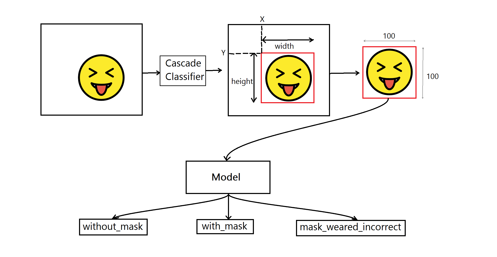
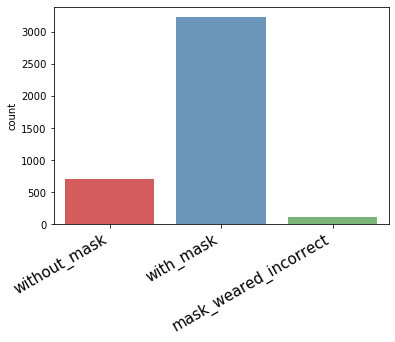
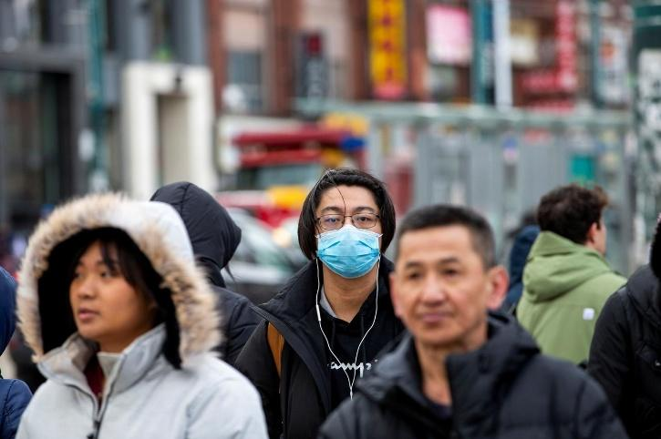
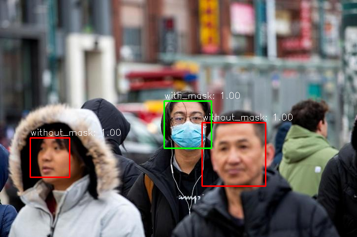

# Real-time Face Mask Detection

## Overview
Face masks help reduce the transmission of <a href="https://en.wikipedia.org/wiki/Severe_acute_respiratory_syndrome_coronavirus_2">SARS-CoV-2</a> by interfering with the spread of virus-laden droplets ejected from the nose and mouth. 
Wearing face mask is one of the precautionary steps an individual can take in order to lessen the spread of <a href="https://en.wikipedia.org/wiki/Coronavirus_disease_2019">COVID-19</a>.
In this simple project, a video camera detects if an individual is wearing a face mask or not in real-time.
 The detection steps looks somewhat like this:

## Quickstart the project
1. Download the code in `ZIP` or open with `GitHub Desktop` or `git clone https://github.com/FarhanSadaf/face-mask-detection.git`. If you face issues downloading weight file, you can download from this <a href="https://drive.google.com/file/d/16B5N0LT5YGlH6MPnmsoF-9ri0MhO3bNv/view">google drive link</a>.
2. Install required python dependencies into your python environment / virtual environment using `pip install -r requirements.txt`.
3. Run `script-1.py` for real-time detection using webcam. If detection isn't to your liking, try running `script-2.py`.

## Dataset
The dataset used to train the face-mask detection model taken from <a href="https://www.kaggle.com/andrewmvd/face-mask-detection">here</a>.

This dataset contains 853 images belonging to the 3 classes, as well as their bounding boxes in the PASCAL VOC format.
The classes are:
- With mask
- Without mask
- Mask worn incorrectly

Though the dataset is pretty imbalanced with most of the data belonging to `With mask` class, it works pertty well detecting `With mask` and `Without mask` classes.
But more data for `Mask worn incorrectly` class is needed in order to detect this class properly.

## Workflow
1. <b><a href="https://github.com/FarhanSadaf/face-mask-detection/blob/master/1_data-preprocessing.ipynb">Data preprocessing</a></b> : 
All images have their bounding boxes in the PASCAL VOC format and their info saved in `XML` format in `annotaions` directory. 
Only the region bounded by bounding box taken as input and their respective labels taken as output.

2. <b><a href="https://github.com/FarhanSadaf/face-mask-detection/blob/master/2_training-face-mask-model.ipynb">Training mask detector model</a></b> :
Transfer learning was used to train the inputs. The classifier model was built with <a href="https://www.tensorflow.org/api_docs/python/tf/keras/applications/InceptionV3">InceptionV3</a> neural network architecture.
After training for 20 epochs, accuracy on test set was 96.81%.

3. <b><a href="https://github.com/FarhanSadaf/face-mask-detection/blob/master/3.2_detecting-mask-w-mtcnn.ipynb">Detecting face mask </a><a href="https://github.com/FarhanSadaf/face-mask-detection/blob/master/3.1_detecting-mask-w-haarcascade.ipynb">in real-time</a></b> :
First task was to detect faces from each frame of the video. 
At first I used <a href="https://github.com/FarhanSadaf/face-mask-detection/blob/master/3.1_detecting-mask-w-haarcascade.ipynb">Haarcascade classifer</a> from OpenCV for face detection. Average FPS I got while running on my machine was around 16. 
But face detection wasn't that accurate. This classifer struggled detecting faces with mask. In low-light condition it struggled the most.
 Then I tried <a href="https://github.com/FarhanSadaf/face-mask-detection/blob/master/3.2_detecting-mask-w-mtcnn.ipynb">MTCNN</a> for face detection. 
This algorithm performed great detecting faces, even in the low light. But while running on my machine, the average FPS I got was about 1.4. 
Which is pretty slow comparing with haarcascade classifier. 

## Results
<table>
<tr>
<th>Input</th>
<th>Output</th>
</tr>
<tr>
<td></td>
<td></td>
</tr>
</table>

## Links and References
- Face Mask Detection dataset: https://www.kaggle.com/andrewmvd/face-mask-detection
- InceptionV3: https://www.tensorflow.org/api_docs/python/tf/keras/applications/InceptionV3
- Face Detection using Haar Cascades: https://opencv-python-tutroals.readthedocs.io/en/latest/py_tutorials/py_objdetect/py_face_detection/py_face_detection.html
- How to Perform Face Detection with Deep Learning: https://machinelearningmastery.com/how-to-perform-face-detection-with-classical-and-deep-learning-methods-in-python-with-keras/
- GitHub MTCNN: https://github.com/ipazc/mtcnn

## Licensing
The code in this project is licensed under [MIT License](LICENSE).
